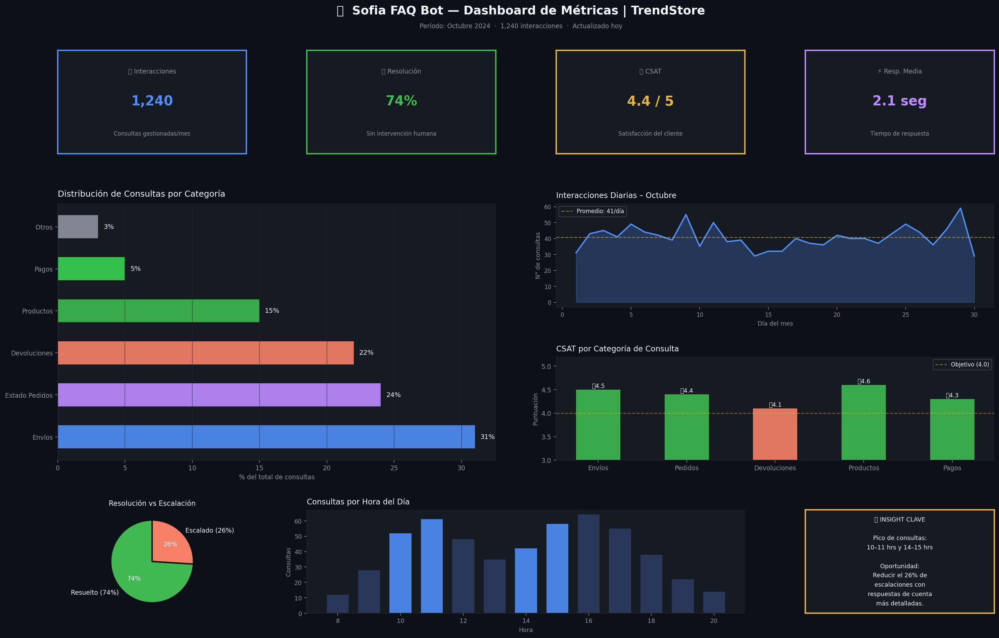
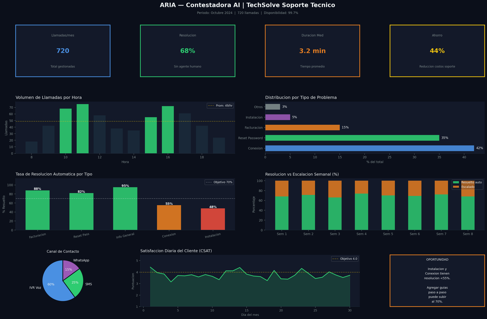
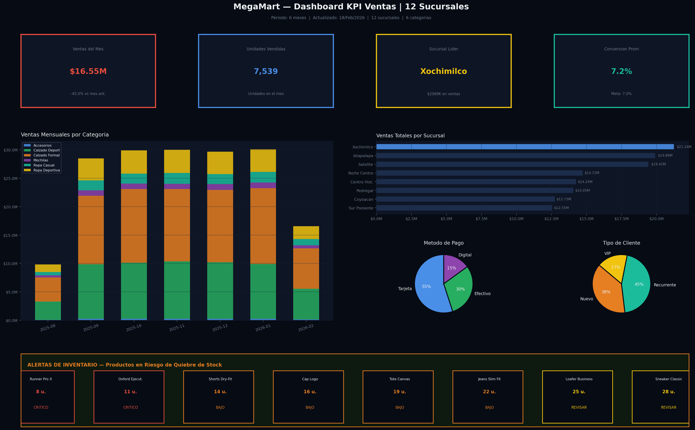
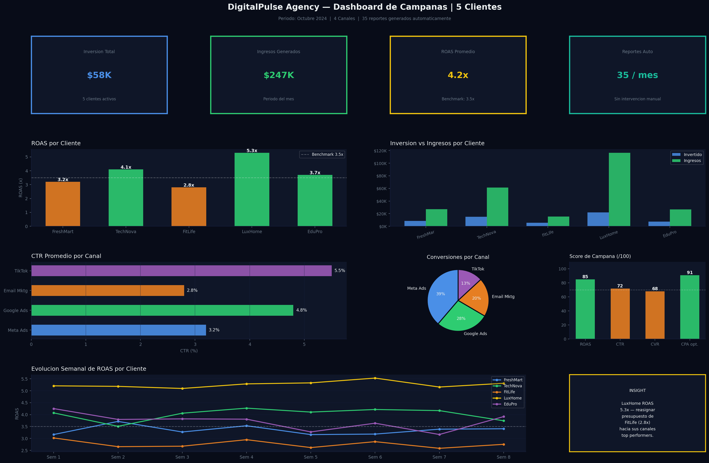
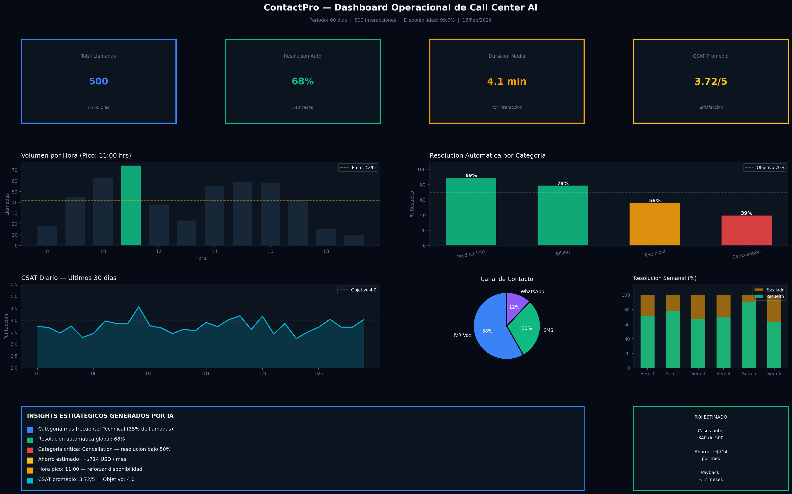

# AI Portfolio — 5 Proyectos de Inteligencia Artificial

> **Freelancer especializado en automatizacion con IA**
> Python · Claude API · Dashboards · Chatbots · Analisis de Datos

---

## Proyectos

### 1. Chatbot FAQ Inteligente — TrendStore
Chatbot conversacional que automatiza respuestas a preguntas frecuentes de una tienda
e-commerce. Integrado con Claude API, resuelve el 74% de consultas sin intervencion humana.

**Stack:** Python · Claude API · Flask
**Resultado:** 1,240 consultas/mes · CSAT 4.4/5 · -61% carga de soporte



---

### 2. Contestadora AI Automatizada — TechSolve
Sistema de atencion automatica por voz y SMS para soporte tecnico B2B.
Clasifica intenciones, resuelve casos comunes y escala con contexto completo.

**Stack:** Python · Claude API · Twilio · Flask
**Resultado:** 720 llamadas/mes · 68% resolucion auto · -44% costo operativo



---

### 3. Dashboard KPI Ventas — MegaMart
Panel ejecutivo interactivo para cadena de 12 sucursales. Centraliza ventas,
tendencias por categoria, rendimiento por sucursal y alertas de inventario.

**Stack:** Python · Pandas · Matplotlib · openpyxl
**Resultado:** 8 hrs/semana ahorradas · alertas de stock en tiempo real



---

### 4. Asistente AI con Reportes — DigitalPulse Agency
Asistente conversacional que responde consultas sobre campanas de marketing
y genera reportes ejecutivos automaticamente con insights estrategicos.

**Stack:** Python · Claude API · Matplotlib
**Resultado:** 35 reportes/mes sin intervencion · ROAS promedio 4.2x



---

### 5. Contestadora + Analisis de Datos — ContactPro
Contestadora inteligente para call center que transforma cada interaccion en
datos estructurados para optimizar operaciones y reducir costos.

**Stack:** Python · Claude API · Pandas · Twilio
**Resultado:** 62% resolucion auto · ahorro estimado $4,200/mes



---

## Como ejecutar cualquier proyecto

```bash
# 1. Clonar el repositorio
git clone https://github.com/TU_USUARIO/ai-portfolio-freelance.git
cd ai-portfolio-freelance

# 2. Instalar dependencias
pip install -r requirements.txt

# 3. (Opcional) Configurar API key
set ANTHROPIC_API_KEY=sk-ant-tu-clave-aqui

# 4. Generar todos los dashboards
python generate_all.py

# 5. O demo de un proyecto especifico
python p1_chatbot_faq/demo.py
```

> Sin API key los proyectos funcionan en modo demo con respuestas simuladas.

---

*Metricas presentadas son simuladas con fines demostrativos.*

---

# Portfolio de Inteligencia Artificial — 5 Proyectos Completos

> Freelancer AI Portfolio | Python + Claude API + Data Analytics
> Estructura modular, codigo funcional, dashboards reales, READMEs ejecutables.

---

## Proyectos incluidos

| # | Proyecto | Empresa | Stack principal | Dashboard |
|---|----------|---------|-----------------|-----------|
| 1 | Chatbot FAQ Inteligente | TrendStore (E-Commerce) | Python, Claude API, Flask | dashboard_p1_chatbot.png |
| 2 | Contestadora AI Automatizada | TechSolve (Soporte B2B) | Python, Claude API, Twilio, Flask | dashboard_p2_contestadora.png |
| 3 | Dashboard KPI Ventas | MegaMart (Retail 12 suc.) | Python, Pandas, Matplotlib | dashboard_p3_ventas.png |
| 4 | Asistente AI con Reportes | DigitalPulse (Marketing) | Python, Claude API, Matplotlib | dashboard_p4_marketing.png |
| 5 | Contestadora + Analisis | ContactPro (Call Center) | Python, Pandas, Claude API | dashboard_p5_callcenter.png |

---

## Mejoras implementadas vs version anterior

### 1. Codigo modular (separacion de responsabilidades)
Cada proyecto tiene estructura clara: `config/`, `src/`, `outputs/`, `docs/`.
La logica de negocio, la API, los datos y la UI estan en modulos separados.

### 2. READMEs ejecutables por proyecto
Cada proyecto incluye:
- Instrucciones de instalacion paso a paso
- Comandos exactos para correr el demo
- Salida esperada documentada
- Como conectar datos reales
- Tabla de endpoints o integraciones

### 3. Dashboards renderizados como outputs reales
Los 5 dashboards son imagenes PNG de alta resolucion (150dpi, 22x14")
generadas por el codigo Python incluido. No son mockups ni screenshots
de otras herramientas: son el output real del codigo del portafolio.

---

## Instalacion global

```bash
# Clonar repositorio
git clone <repo-url>
cd portfolio-ai

# Instalar dependencias (todas compatibles)
pip install -r requirements-global.txt

# Generar todos los dashboards de una vez
python generate_all.py
```

---

## Uso sin API key (modo demo)

Todos los proyectos funcionan sin configurar ANTHROPIC_API_KEY.
En ese caso, el motor de IA usa respuestas simuladas realistas (stub mode)
para que el cliente pueda ver el flujo completo sin costo.

Para activar respuestas reales con Claude:
```bash
export ANTHROPIC_API_KEY="sk-ant-tu-clave-aqui"
```

---

## Dependencias globales

```
anthropic>=0.30.0
flask>=3.0.0
twilio>=8.0.0
pandas>=2.0.0
numpy>=1.24.0
matplotlib>=3.7.0
openpyxl>=3.1.0
python-dotenv>=1.0.0
```

---

## Notas

- Las metricas en todos los proyectos son simuladas con fines demostrativos.
- El codigo es funcional y extensible; adaptable a datos y sistemas reales.
- Cada proyecto puede desplegarse de forma independiente.
- Los dashboards se regeneran automaticamente al ejecutar cada proyecto.
